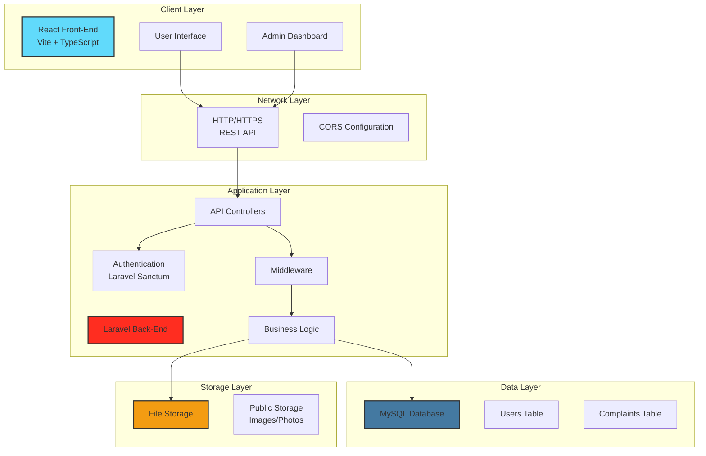
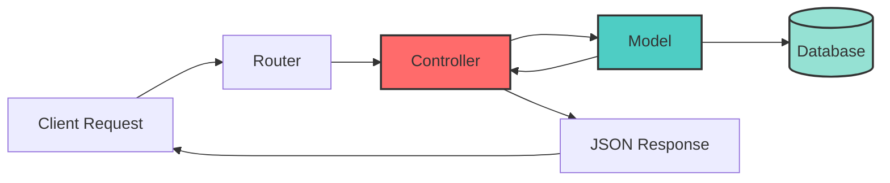
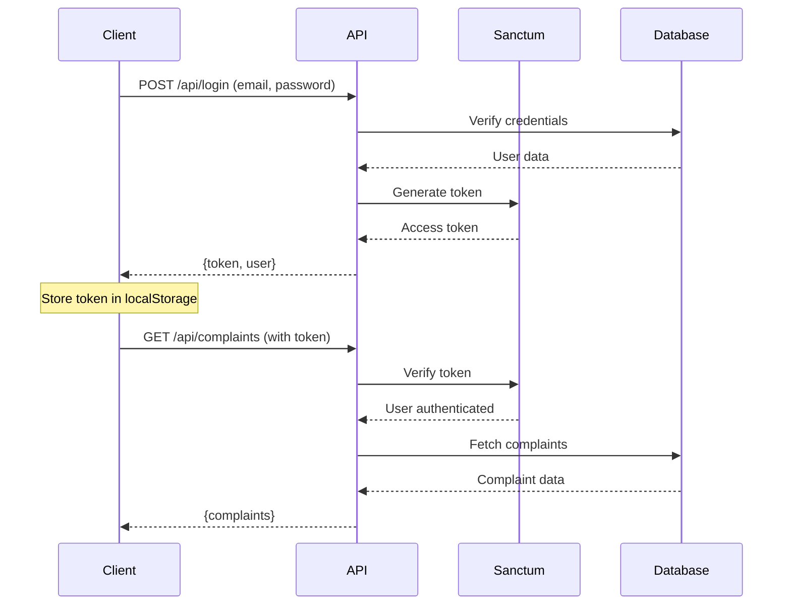
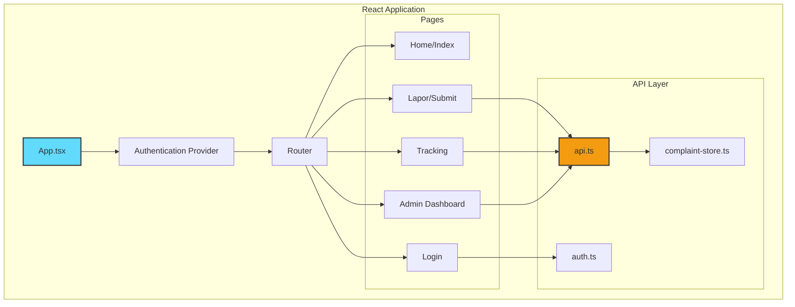
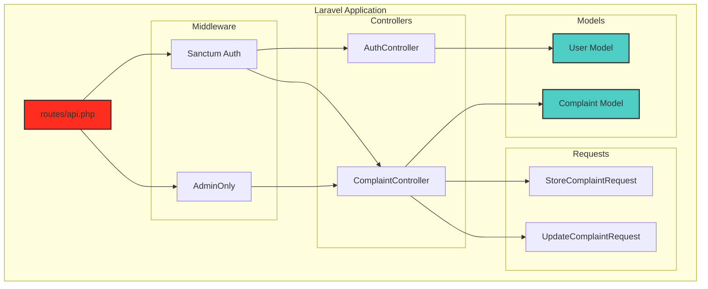
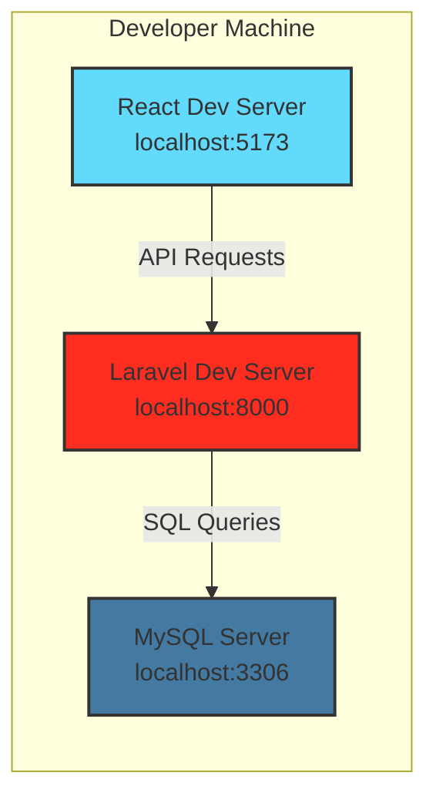
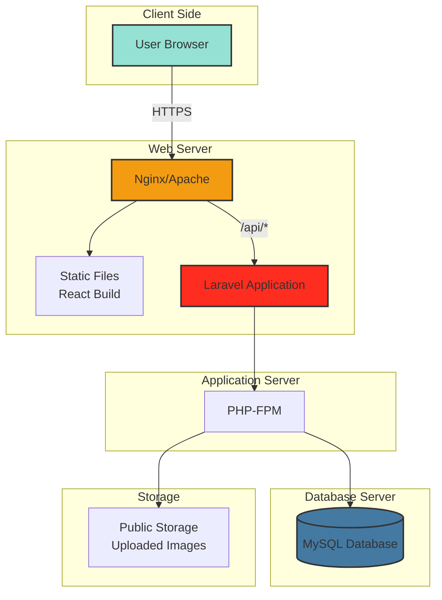
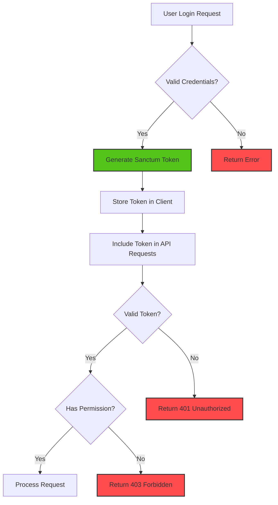
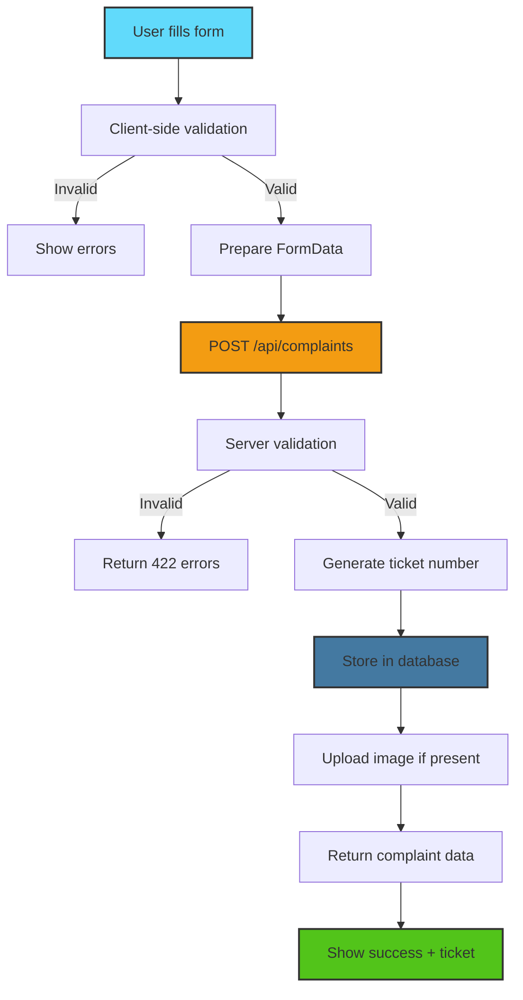
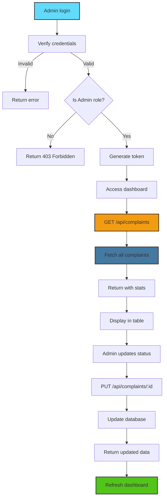

# Perancangan Arsitektur Sistem Lapor Warga

## 1. Gambaran Umum Sistem

**Lapor Warga** adalah aplikasi sistem pengaduan masyarakat yang memungkinkan warga untuk melaporkan berbagai masalah infrastruktur dan layanan publik. Sistem ini menggunakan arsitektur **Client-Server** dengan pemisahan jelas antara front-end dan back-end.

## 2. Arsitektur Sistem

## 3. Technology Stack

### 3.1 Front-End
| Komponen | Teknologi | Versi |
|----------|-----------|-------|
| Framework | React | 18.x |
| Build Tool | Vite | Latest |
| Language | TypeScript | 5.x |
| UI Library | shadcn-ui | Latest |
| Styling | Tailwind CSS | 3.x |
| HTTP Client | Axios | 1.x |
| Routing | React Router | 6.x |
| State Management | React Query | Latest |

### 3.2 Back-End
| Komponen | Teknologi | Versi |
|----------|-----------|-------|
| Framework | Laravel | 10.x |
| Language | PHP | 8.1+ |
| Database | MySQL | 8.0+ |
| Authentication | Laravel Sanctum | 3.x |
| API Style | RESTful | - |
| Validation | Form Requests | Built-in |

## 4. Arsitektur Aplikasi

### 4.1 Model-View-Controller (MVC) Pattern

### 4.2 Authentication Flow

## 5. Komponen Sistem

### 5.1 Client-Side Components

### 5.2 Server-Side Components

## 6. Deployment Architecture

### 6.1 Development Environment

### 6.2 Production Environment (Recommended)

## 7. Security Architecture

### 7.1 Authentication & Authorization

### 7.2 Security Layers

| Layer | Mechanism | Purpose |
|-------|-----------|---------|
| **Transport** | HTTPS/TLS | Encrypt data in transit |
| **Authentication** | Laravel Sanctum | Verify user identity |
| **Authorization** | Role-based (User/Admin) | Control access to resources |
| **Input Validation** | Form Requests | Prevent injection attacks |
| **CORS** | Laravel CORS Middleware | Control cross-origin requests |
| **File Upload** | Type & size validation | Prevent malicious uploads |
| **SQL Injection** | Eloquent ORM | Parameterized queries |

## 8. Data Flow Architecture

### 8.1 Complaint Submission Flow

### 8.2 Admin Dashboard Flow

## 9. Scalability Considerations

### 9.1 Horizontal Scaling Options

- **Load Balancer**: Distribute requests across multiple Laravel instances
- **Database Replication**: Master-slave configuration for read scaling
- **CDN**: Serve static assets and uploaded images
- **Caching**: Redis/Memcached for session and query caching

### 9.2 Performance Optimization

- **Database Indexing**: Index on `ticket_number`, `status`, `created_at`
- **API Response Caching**: Cache complaint statistics
- **Eager Loading**: Prevent N+1 queries in relationships
- **Image Optimization**: Compress uploaded images
- **Pagination**: Limit results for large datasets

## 10. Monitoring & Logging

### 10.1 Application Monitoring

- **Laravel Log**: Store errors and important events
- **API Request Logging**: Track API usage and errors
- **Database Query Monitoring**: Identify slow queries
- **User Activity Logs**: Audit trail for admin actions

### 10.2 Key Metrics

- Complaint submission rate
- Average response time
- Status update frequency
- Admin activity logs
- Error rates by endpoint

## 11. Backup & Recovery

### 11.1 Backup Strategy

- **Database Backup**: Daily automated MySQL dumps
- **File Storage Backup**: Periodic backup of uploaded images
- **Configuration Backup**: Version control for .env and configs

### 11.2 Recovery Plan

- Database restore from latest backup
- Image recovery from storage backup
- Application redeployment from Git repository
