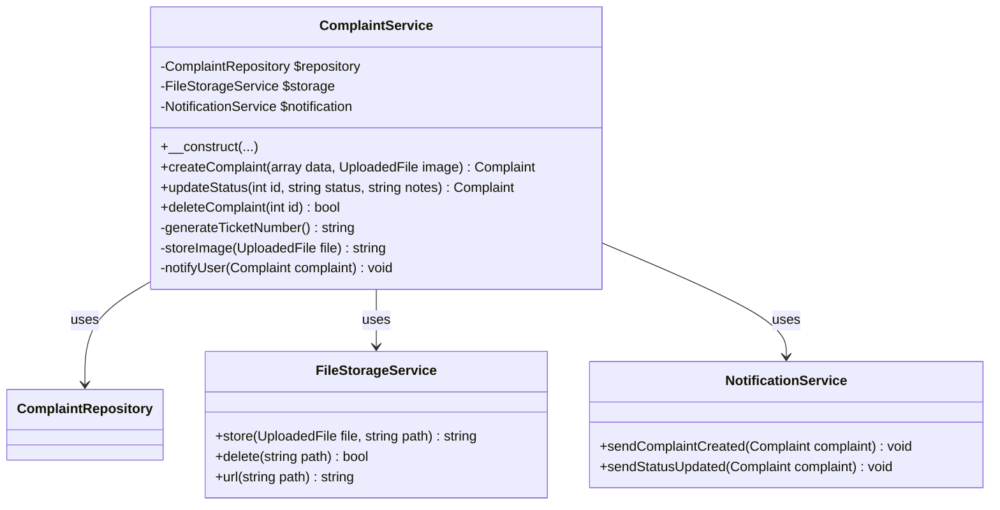

# Perancangan Class Diagram - Lapor Warga

Dokumen ini menjelaskan struktur kelas dalam sistem Lapor Warga, termasuk Models, Controllers, Requests, dan Middleware.

## 1. Complete Class Diagram

## 2. Model Layer Details

### 2.1 User Model

### 2.2 Complaint Model

## 3. Controller Layer

### 3.1 AuthController

### 3.2 ComplaintController

## 4. Request Validation Layer

### 4.1 Form Requests

### 4.2 Validation Rules Detail

## 5. Middleware Layer

### 5.1 AdminOnly Middleware

## 6. Repository Pattern (Optional)

### 6.1 Repository Classes

## 7. Service Layer (Optional)

### 7.1 Service Classes

## 8. Resource/Transformer Layer

### 8.1 API Resources

## 9. Complete System Class Diagram

## Summary

Class diagram ini menggambarkan:

1. **Model Layer**: User dan Complaint models dengan properties, methods, dan relationships
2. **Controller Layer**: AuthController dan ComplaintController untuk handling HTTP requests
3. **Request Layer**: Form validation classes untuk setiap operation
4. **Middleware Layer**: AdminOnly untuk role-based access control
5. **Repository Pattern**: Optional abstraction layer untuk data access
6. **Service Layer**: Optional business logic separation
7. **Resource Layer**: API response transformation
8. **Frontend Integration**: Service classes untuk API communication

Struktur ini mengikuti best practices Laravel dan SOLID principles untuk maintainability dan scalability.
