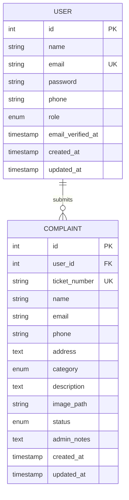
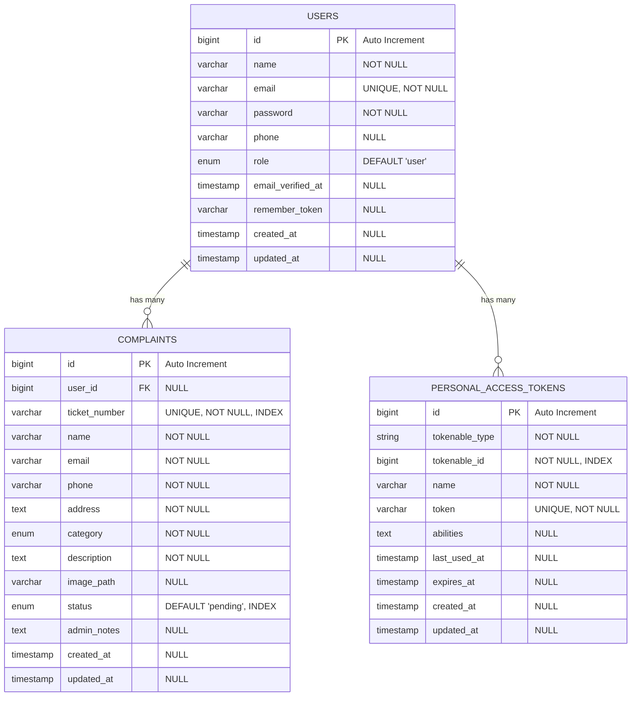
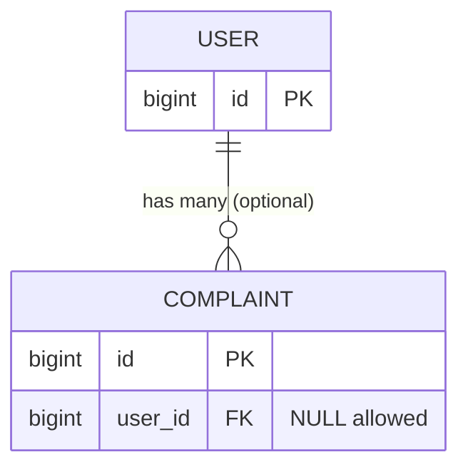
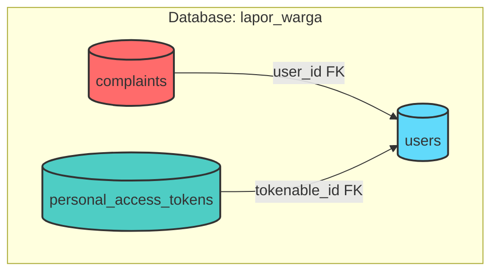

# Perancangan Basis Data - Lapor Warga

Dokumen ini menjelaskan perancangan database untuk sistem Lapor Warga, termasuk ERD, struktur tabel, dan relasi.

## 1. Entity Relationship Diagram (ERD)

### 1.1 Conceptual ERD



### 1.2 Detailed ERD with Attributes



## 2. Database Schema

### 2.1 Users Table

**Nama Tabel**: `users`

| Column | Type | Length | Null | Default | Extra | Index | Description |
|--------|------|--------|------|---------|-------|-------|-------------|
| id | BIGINT | - | NO | - | AUTO_INCREMENT | PRIMARY | User ID |
| name | VARCHAR | 255 | NO | - | - | - | Nama lengkap user |
| email | VARCHAR | 255 | NO | - | - | UNIQUE | Email user (untuk login) |
| password | VARCHAR | 255 | NO | - | - | - | Password (hashed) |
| phone | VARCHAR | 20 | YES | NULL | - | - | Nomor telepon |
| role | ENUM | - | NO | 'user' | - | INDEX | Role: 'user' or 'admin' |
| email_verified_at | TIMESTAMP | - | YES | NULL | - | - | Waktu verifikasi email |
| remember_token | VARCHAR | 100 | YES | NULL | - | - | Remember me token |
| created_at | TIMESTAMP | - | YES | NULL | - | - | Waktu pembuatan |
| updated_at | TIMESTAMP | - | YES | NULL | - | - | Waktu update terakhir |

**Indexes**:
- PRIMARY KEY: `id`
- UNIQUE KEY: `users_email_unique` (`email`)
- INDEX: `users_role_index` (`role`)

**Constraints**:
- Email must be unique
- Role must be 'user' or 'admin'

**SQL Migration**:
```sql
CREATE TABLE users (
    id BIGINT UNSIGNED AUTO_INCREMENT PRIMARY KEY,
    name VARCHAR(255) NOT NULL,
    email VARCHAR(255) NOT NULL,
    password VARCHAR(255) NOT NULL,
    phone VARCHAR(20) NULL,
    role ENUM('user', 'admin') NOT NULL DEFAULT 'user',
    email_verified_at TIMESTAMP NULL,
    remember_token VARCHAR(100) NULL,
    created_at TIMESTAMP NULL,
    updated_at TIMESTAMP NULL,
    UNIQUE KEY users_email_unique (email),
    INDEX users_role_index (role)
) ENGINE=InnoDB DEFAULT CHARSET=utf8mb4 COLLATE=utf8mb4_unicode_ci;
```

### 2.2 Complaints Table

**Nama Tabel**: `complaints`

| Column | Type | Length | Null | Default | Extra | Index | Description |
|--------|------|--------|------|---------|-------|-------|-------------|
| id | BIGINT | - | NO | - | AUTO_INCREMENT | PRIMARY | Complaint ID |
| user_id | BIGINT | - | YES | NULL | - | FOREIGN | ID user (NULL = anonymous) |
| ticket_number | VARCHAR | 50 | NO | - | - | UNIQUE | Nomor tiket unik |
| name | VARCHAR | 255 | NO | - | - | - | Nama pelapor |
| email | VARCHAR | 255 | NO | - | - | - | Email pelapor |
| phone | VARCHAR | 20 | NO | - | - | - | No HP pelapor |
| address | TEXT | - | NO | - | - | - | Alamat lokasi masalah |
| category | ENUM | - | NO | - | - | INDEX | Kategori masalah |
| description | TEXT | - | NO | - | - | - | Deskripsi masalah |
| image_path | VARCHAR | 255 | YES | NULL | - | - | Path gambar |
| status | ENUM | - | NO | 'pending' | - | INDEX | Status laporan |
| admin_notes | TEXT | - | YES | NULL | - | - | Catatan admin |
| created_at | TIMESTAMP | - | YES | NULL | - | INDEX | Waktu pembuatan |
| updated_at | TIMESTAMP | - | YES | NULL | - | - | Waktu update terakhir |

**Enums**:
- **category**: 'jalan_rusak', 'sampah', 'penerangan', 'saluran_air', 'fasilitas_umum', 'lainnya'
- **status**: 'pending', 'in_progress', 'completed', 'rejected'

**Indexes**:
- PRIMARY KEY: `id`
- UNIQUE KEY: `complaints_ticket_number_unique` (`ticket_number`)
- FOREIGN KEY: `complaints_user_id_foreign` (`user_id`) REFERENCES `users` (`id`) ON DELETE SET NULL
- INDEX: `complaints_status_index` (`status`)
- INDEX: `complaints_category_index` (`category`)
- INDEX: `complaints_created_at_index` (`created_at`)

**Constraints**:
- ticket_number must be unique
- category must be one of the defined values
- status must be one of the defined values
- If user is deleted, user_id is set to NULL but complaint remains

**SQL Migration**:
```sql
CREATE TABLE complaints (
    id BIGINT UNSIGNED AUTO_INCREMENT PRIMARY KEY,
    user_id BIGINT UNSIGNED NULL,
    ticket_number VARCHAR(50) NOT NULL,
    name VARCHAR(255) NOT NULL,
    email VARCHAR(255) NOT NULL,
    phone VARCHAR(20) NOT NULL,
    address TEXT NOT NULL,
    category ENUM('jalan_rusak', 'sampah', 'penerangan', 'saluran_air', 'fasilitas_umum', 'lainnya') NOT NULL,
    description TEXT NOT NULL,
    image_path VARCHAR(255) NULL,
    status ENUM('pending', 'in_progress', 'completed', 'rejected') NOT NULL DEFAULT 'pending',
    admin_notes TEXT NULL,
    created_at TIMESTAMP NULL,
    updated_at TIMESTAMP NULL,
    UNIQUE KEY complaints_ticket_number_unique (ticket_number),
    INDEX complaints_status_index (status),
    INDEX complaints_category_index (category),
    INDEX complaints_created_at_index (created_at),
    CONSTRAINT complaints_user_id_foreign 
        FOREIGN KEY (user_id) 
        REFERENCES users (id) 
        ON DELETE SET NULL
        ON UPDATE CASCADE
) ENGINE=InnoDB DEFAULT CHARSET=utf8mb4 COLLATE=utf8mb4_unicode_ci;
```

### 2.3 Personal Access Tokens Table (Laravel Sanctum)

**Nama Tabel**: `personal_access_tokens`

| Column | Type | Length | Null | Default | Extra | Index | Description |
|--------|------|--------|------|---------|-------|-------|-------------|
| id | BIGINT | - | NO | - | AUTO_INCREMENT | PRIMARY | Token ID |
| tokenable_type | VARCHAR | 255 | NO | - | - | - | Model type (User) |
| tokenable_id | BIGINT | - | NO | - | - | INDEX | User ID |
| name | VARCHAR | 255 | NO | - | - | - | Token name |
| token | VARCHAR | 64 | NO | - | - | UNIQUE | Hashed token |
| abilities | TEXT | - | YES | NULL | - | - | Token abilities (JSON) |
| last_used_at | TIMESTAMP | - | YES | NULL | - | - | Last usage timestamp |
| expires_at | TIMESTAMP | - | YES | NULL | - | - | Expiration timestamp |
| created_at | TIMESTAMP | - | YES | NULL | - | - | Creation timestamp |
| updated_at | TIMESTAMP | - | YES | NULL | - | - | Update timestamp |

**Indexes**:
- PRIMARY KEY: `id`
- UNIQUE KEY: `personal_access_tokens_token_unique` (`token`)
- INDEX: `personal_access_tokens_tokenable_type_tokenable_id_index` (`tokenable_type`, `tokenable_id`)

## 3. Relationships

### 3.1 One-to-Many: User → Complaints



**Relationship Details**:
- **Type**: One-to-Many (Optional)
- **From**: users.id
- **To**: complaints.user_id
- **Cascading**: ON DELETE SET NULL, ON UPDATE CASCADE
- **Description**: Satu user dapat membuat banyak complaints. Jika user dihapus, complaints tetap ada dengan user_id = NULL (anonymous complaint).

**Laravel Eloquent**:
```php
// In User model
public function complaints()
{
    return $this->hasMany(Complaint::class);
}

// In Complaint model
public function user()
{
    return $this->belongsTo(User::class);
}
```

## 4. Data Dictionary

### 4.1 Category Types

| Value | Label | Description |
|-------|-------|-------------|
| jalan_rusak | Jalan Rusak | Jalan berlubang, rusak, atau perlu perbaikan |
| sampah | Sampah Menumpuk | Sampah yang menumpuk dan tidak diangkut |
| penerangan | Penerangan Jalan Mati | Lampu jalan mati atau rusak |
| saluran_air | Saluran Air Tersumbat | Saluran air/drainase tersumbat |
| fasilitas_umum | Fasilitas Umum Rusak | Fasilitas umum yang rusak |
| lainnya | Lainnya | Masalah lainnya |

### 4.2 Status Types

| Value | Label | Color | Description |
|-------|-------|-------|-------------|
| pending | Menunggu | Yellow/Warning | Laporan baru, menunggu review |
| in_progress | Diproses | Blue/Info | Laporan sedang ditangani |
| completed | Selesai | Green/Success | Laporan telah selesai ditangani |
| rejected | Ditolak | Red/Danger | Laporan ditolak |

### 4.3 User Roles

| Value | Label | Permissions |
|-------|-------|-------------|
| user | User | Create complaint, track own complaints |
| admin | Admin | All user permissions + view all complaints, update status, add notes |

## 5. Indexing Strategy

### 5.1 Critical Indexes

| Table | Column(s) | Type | Purpose |
|-------|-----------|------|---------|
| users | email | UNIQUE | Fast login lookup, ensure uniqueness |
| users | role | INDEX | Filter by role (admin queries) |
| complaints | ticket_number | UNIQUE | Fast tracking lookup |
| complaints | status | INDEX | Filter by status (dashboard) |
| complaints | category | INDEX | Filter by category |
| complaints | created_at | INDEX | Sort by date, reporting |
| complaints | user_id | FOREIGN KEY | Relationship queries |

### 5.2 Composite Indexes (Optional for Performance)

```sql
-- For admin dashboard filtering
CREATE INDEX complaints_status_created_at_index 
ON complaints (status, created_at DESC);

-- For category-based reporting
CREATE INDEX complaints_category_status_index 
ON complaints (category, status);
```

## 6. Sample Data

### 6.1 Default Admin User

```sql
INSERT INTO users (name, email, password, phone, role, created_at, updated_at) 
VALUES (
    'Administrator',
    'admin@laporwarga.com',
    '$2y$10$92IXUNpkjO0rOQ5byMi.Ye4oKoEa3Ro9llC/.og/at2.uheWG/igi', -- password: admin123
    '081234567890',
    'admin',
    NOW(),
    NOW()
);
```

### 6.2 Sample Complaints

```sql
INSERT INTO complaints (
    user_id, ticket_number, name, email, phone, address, 
    category, description, status, created_at, updated_at
) VALUES 
(
    NULL,
    'LP241205-ABC123',
    'John Doe',
    'john@example.com',
    '081234567890',
    'Jl. Sudirman No. 123, Jakarta',
    'jalan_rusak',
    'Jalan berlubang besar di depan rumah, sangat berbahaya untuk pengendara motor',
    'pending',
    NOW(),
    NOW()
),
(
    1,
    'LP241205-DEF456',
    'Administrator',
    'admin@laporwarga.com',
    '081234567890',
    'Jl. Gatot Subroto No. 45, Jakarta',
    'penerangan',
    'Lampu jalan mati sejak 3 hari yang lalu',
    'in_progress',
    NOW(),
    NOW()
);
```

## 7. Database Diagram (Visual)



## 8. Query Examples

### 8.1 Common Queries

```sql
-- Get all pending complaints
SELECT * FROM complaints 
WHERE status = 'pending' 
ORDER BY created_at DESC;

-- Get complaints by ticket number
SELECT * FROM complaints 
WHERE ticket_number = 'LP241205-ABC123';

-- Get complaint statistics
SELECT 
    status,
    COUNT(*) as total,
    category
FROM complaints 
GROUP BY status, category;

-- Get user's complaints
SELECT c.*, u.name as user_name 
FROM complaints c
LEFT JOIN users u ON c.user_id = u.id
WHERE u.id = 1
ORDER BY c.created_at DESC;

-- Get admin users
SELECT * FROM users WHERE role = 'admin';
```

### 8.2 Performance Queries

```sql
-- Get complaints with pagination
SELECT * FROM complaints 
ORDER BY created_at DESC 
LIMIT 10 OFFSET 0;

-- Search complaints
SELECT * FROM complaints 
WHERE ticket_number LIKE '%ABC%' 
   OR name LIKE '%John%'
   OR address LIKE '%Jakarta%';

-- Count by status (for dashboard stats)
SELECT 
    COUNT(*) as total,
    SUM(CASE WHEN status = 'pending' THEN 1 ELSE 0 END) as pending,
    SUM(CASE WHEN status = 'in_progress' THEN 1 ELSE 0 END) as in_progress,
    SUM(CASE WHEN status = 'completed' THEN 1 ELSE 0 END) as completed,
    SUM(CASE WHEN status = 'rejected' THEN 1 ELSE 0 END) as rejected
FROM complaints;
```

## 9. Backup & Maintenance

### 9.1 Backup Strategy

```bash
# Daily backup
mysqldump -u root -p lapor_warga > backup_$(date +%Y%m%d).sql

# Backup with gzip
mysqldump -u root -p lapor_warga | gzip > backup_$(date +%Y%m%d).sql.gz
```

### 9.2 Database Optimization

```sql
-- Analyze tables
ANALYZE TABLE users, complaints, personal_access_tokens;

-- Optimize tables
OPTIMIZE TABLE users, complaints, personal_access_tokens;

-- Check table status
SHOW TABLE STATUS WHERE Name IN ('users', 'complaints');
```

## Summary

Database ini dirancang dengan prinsip:

1. **Normalization**: Menghindari redundansi data dengan proper relationships
2. **Performance**: Index pada kolom yang sering di-query
3. **Scalability**: Struktur yang dapat dikembangkan untuk fitur future
4. **Data Integrity**: Foreign keys dan constraints untuk menjaga konsistensi
5. **Flexibility**: User bisa anonim (user_id NULL) atau terdaftar
6. **Security**: Password hashing, role-based access
7. **Audit Trail**: Timestamps untuk tracking

Schema ini mendukung semua fitur aplikasi Lapor Warga dengan performa optimal.
