# Perancangan Sequence Diagram - Lapor Warga

Dokumen ini menjelaskan alur interaksi antar komponen sistem dalam berbagai skenario menggunakan sequence diagram.

## 1. User Registration & Login

### 1.1 Registration Sequence

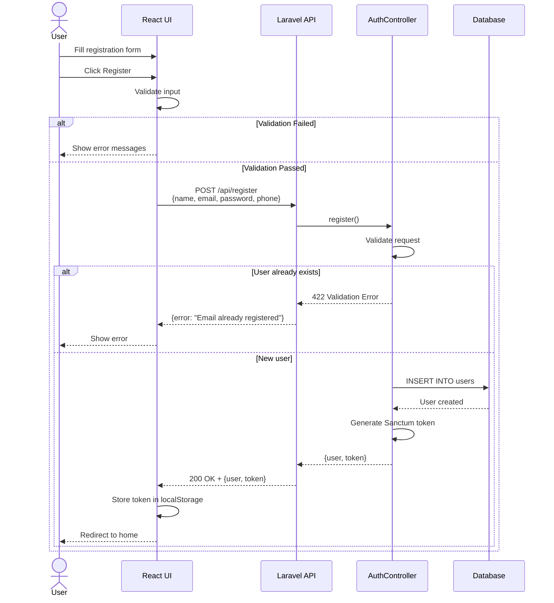
```mermaid
sequenceDiagram
    actor User
    participant UI as React UI
    participant API as Laravel API
    participant Auth as AuthController
    participant DB as Database
    
    User->>UI: Fill registration form
    User->>UI: Click Register
    UI->>UI: Validate input
    
    alt Validation Failed
        UI-->>User: Show error messages
    else Validation Passed
        UI->>API: POST /api/register<br/>{name, email, password, phone}
        API->>Auth: register()
        Auth->>Auth: Validate request
        
        alt User already exists
            Auth-->>API: 422 Validation Error
            API-->>UI: {error: "Email already registered"}
            UI-->>User: Show error
        else New user
            Auth->>DB: INSERT INTO users
            DB-->>Auth: User created
            Auth->>Auth: Generate Sanctum token
            Auth-->>API: {user, token}
            API-->>UI: 200 OK + {user, token}
            UI->>UI: Store token in localStorage
            UI-->>User: Redirect to home
        end
    end
```

### 1.2 Login Sequence

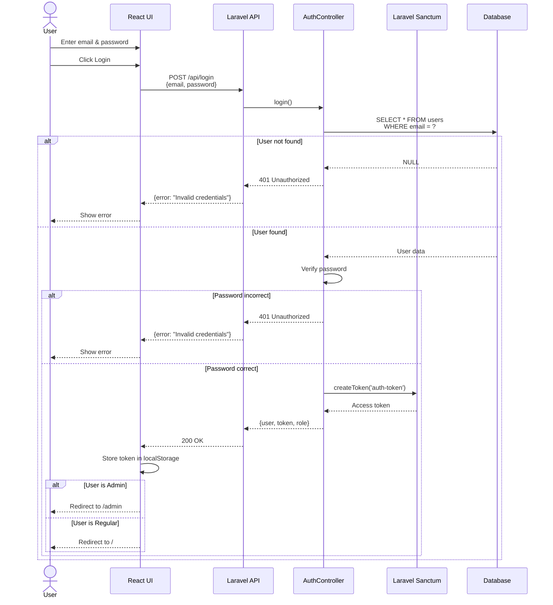
```mermaid
sequenceDiagram
    actor User
    participant UI as React UI
    participant API as Laravel API
    participant Auth as AuthController
    participant Sanctum as Laravel Sanctum
    participant DB as Database
    
    User->>UI: Enter email & password
    User->>UI: Click Login
    UI->>API: POST /api/login<br/>{email, password}
    API->>Auth: login()
    Auth->>DB: SELECT * FROM users<br/>WHERE email = ?
    
    alt User not found
        DB-->>Auth: NULL
        Auth-->>API: 401 Unauthorized
        API-->>UI: {error: "Invalid credentials"}
        UI-->>User: Show error
    else User found
        DB-->>Auth: User data
        Auth->>Auth: Verify password
        
        alt Password incorrect
            Auth-->>API: 401 Unauthorized
            API-->>UI: {error: "Invalid credentials"}
            UI-->>User: Show error
        else Password correct
            Auth->>Sanctum: createToken('auth-token')
            Sanctum-->>Auth: Access token
            Auth-->>API: {user, token, role}
            API-->>UI: 200 OK
            UI->>UI: Store token in localStorage
            
            alt User is Admin
                UI-->>User: Redirect to /admin
            else User is Regular
                UI-->>User: Redirect to /
            end
        end
    end
```

### 1.3 Logout Sequence

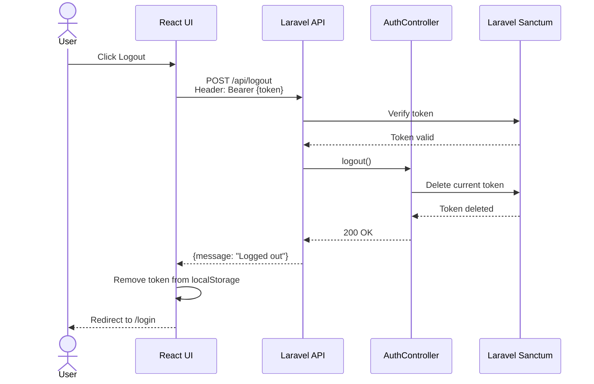
```mermaid
sequenceDiagram
    actor User
    participant UI as React UI
    participant API as Laravel API
    participant Auth as AuthController
    participant Sanctum as Laravel Sanctum
    
    User->>UI: Click Logout
    UI->>API: POST /api/logout<br/>Header: Bearer {token}
    API->>Sanctum: Verify token
    Sanctum-->>API: Token valid
    API->>Auth: logout()
    Auth->>Sanctum: Delete current token
    Sanctum-->>Auth: Token deleted
    Auth-->>API: 200 OK
    API-->>UI: {message: "Logged out"}
    UI->>UI: Remove token from localStorage
    UI-->>User: Redirect to /login
```

## 2. Complaint Submission

### 2.1 Submit Complaint (Anonymous User)

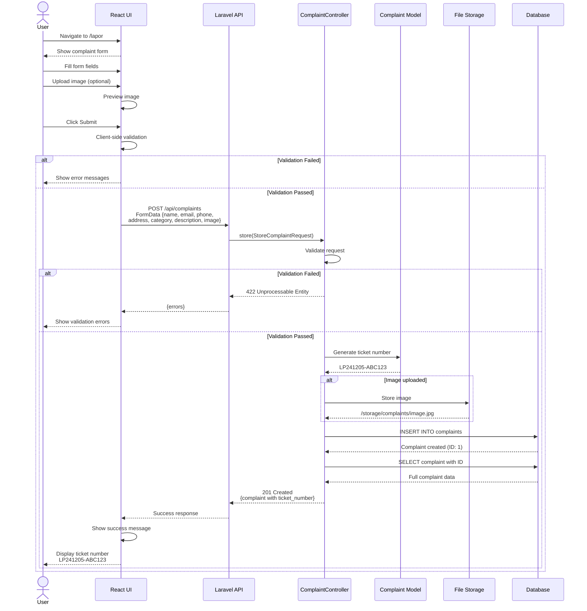
```mermaid
sequenceDiagram
    actor User
    participant UI as React UI
    participant API as Laravel API
    participant Controller as ComplaintController
    participant Model as Complaint Model
    participant Storage as File Storage
    participant DB as Database
    
    User->>UI: Navigate to /lapor
    UI-->>User: Show complaint form
    User->>UI: Fill form fields
    User->>UI: Upload image (optional)
    UI->>UI: Preview image
    User->>UI: Click Submit
    
    UI->>UI: Client-side validation
    alt Validation Failed
        UI-->>User: Show error messages
    else Validation Passed
        UI->>API: POST /api/complaints<br/>FormData {name, email, phone,<br/>address, category, description, image}
        API->>Controller: store(StoreComplaintRequest)
        Controller->>Controller: Validate request
        
        alt Validation Failed
            Controller-->>API: 422 Unprocessable Entity
            API-->>UI: {errors}
            UI-->>User: Show validation errors
        else Validation Passed
            Controller->>Model: Generate ticket number
            Model-->>Controller: LP241205-ABC123
            
            alt Image uploaded
                Controller->>Storage: Store image
                Storage-->>Controller: /storage/complaints/image.jpg
            end
            
            Controller->>DB: INSERT INTO complaints
            DB-->>Controller: Complaint created (ID: 1)
            Controller->>DB: SELECT complaint with ID
            DB-->>Controller: Full complaint data
            Controller-->>API: 201 Created<br/>{complaint with ticket_number}
            API-->>UI: Success response
            UI->>UI: Show success message
            UI-->>User: Display ticket number<br/>LP241205-ABC123
        end
    end
```

### 2.2 Submit Complaint (Authenticated User)

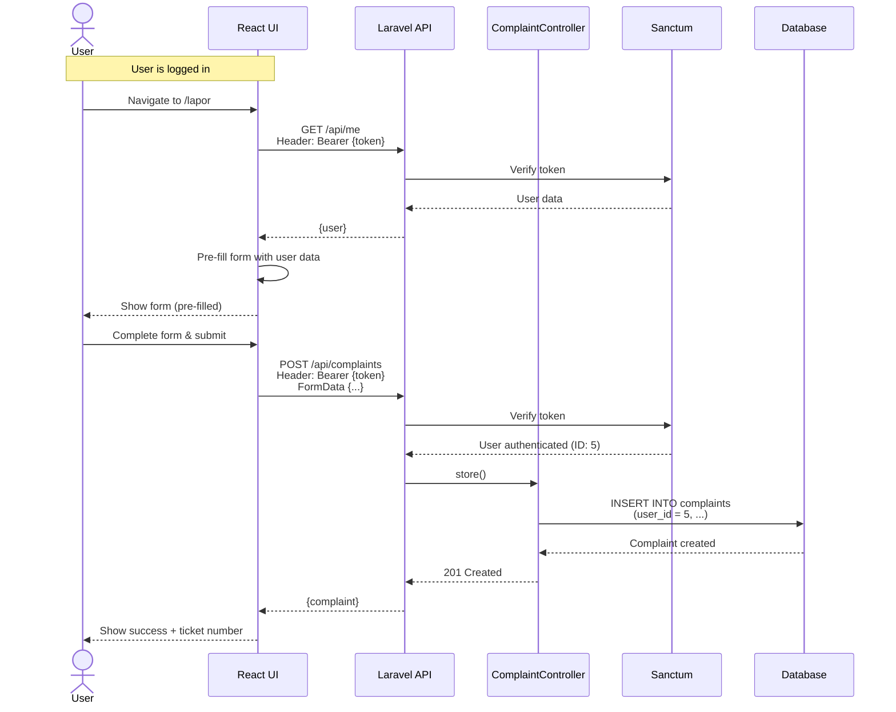
```mermaid
sequenceDiagram
    actor User
    participant UI as React UI
    participant API as Laravel API
    participant Controller as ComplaintController
    participant Auth as Sanctum
    participant DB as Database
    
    Note over User,UI: User is logged in
    
    User->>UI: Navigate to /lapor
    UI->>API: GET /api/me<br/>Header: Bearer {token}
    API->>Auth: Verify token
    Auth-->>API: User data
    API-->>UI: {user}
    UI->>UI: Pre-fill form with user data
    UI-->>User: Show form (pre-filled)
    
    User->>UI: Complete form & submit
    UI->>API: POST /api/complaints<br/>Header: Bearer {token}<br/>FormData {...}
    API->>Auth: Verify token
    Auth-->>API: User authenticated (ID: 5)
    API->>Controller: store()
    Controller->>DB: INSERT INTO complaints<br/>(user_id = 5, ...)
    DB-->>Controller: Complaint created
    Controller-->>API: 201 Created
    API-->>UI: {complaint}
    UI-->>User: Show success + ticket number
```

## 3. Complaint Tracking

### 3.1 Track by Ticket Number

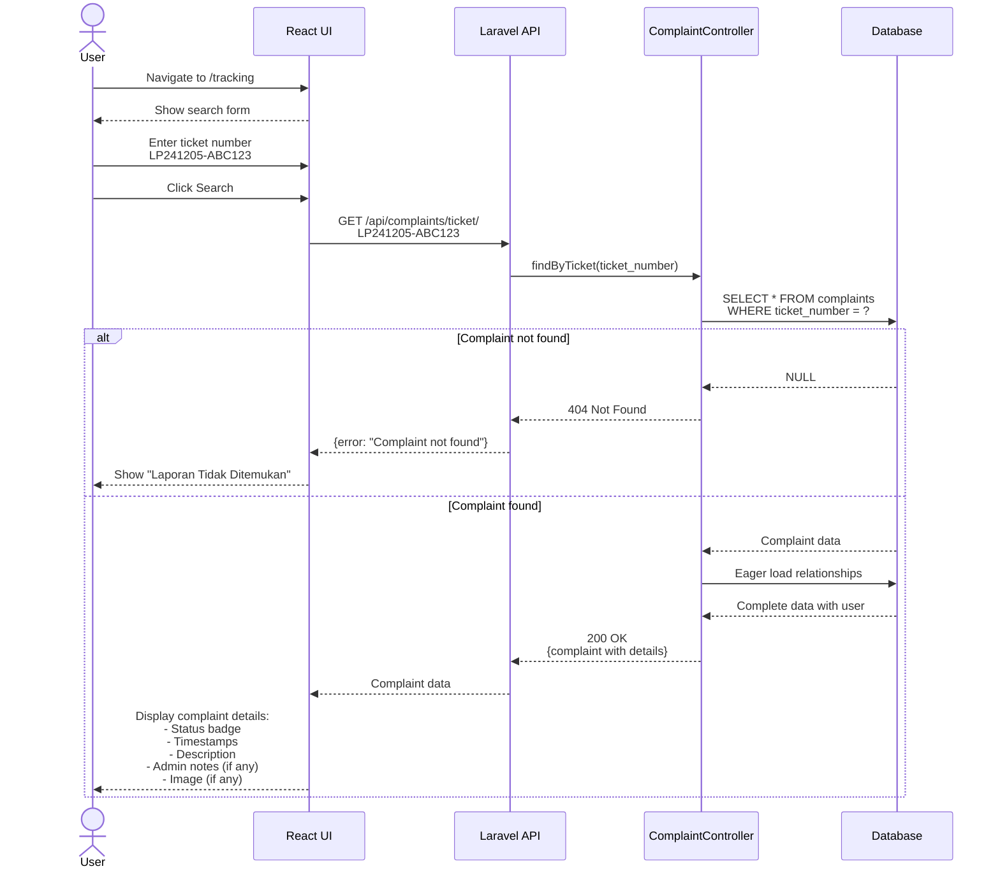
```mermaid
sequenceDiagram
    actor User
    participant UI as React UI
    participant API as Laravel API
    participant Controller as ComplaintController
    participant DB as Database
    
    User->>UI: Navigate to /tracking
    UI-->>User: Show search form
    User->>UI: Enter ticket number<br/>LP241205-ABC123
    User->>UI: Click Search
    
    UI->>API: GET /api/complaints/ticket/<br/>LP241205-ABC123
    API->>Controller: findByTicket(ticket_number)
    Controller->>DB: SELECT * FROM complaints<br/>WHERE ticket_number = ?
    
    alt Complaint not found
        DB-->>Controller: NULL
        Controller-->>API: 404 Not Found
        API-->>UI: {error: "Complaint not found"}
        UI-->>User: Show "Laporan Tidak Ditemukan"
    else Complaint found
        DB-->>Controller: Complaint data
        Controller->>DB: Eager load relationships
        DB-->>Controller: Complete data with user
        Controller-->>API: 200 OK<br/>{complaint with details}
        API-->>UI: Complaint data
        UI-->>User: Display complaint details:<br/>- Status badge<br/>- Timestamps<br/>- Description<br/>- Admin notes (if any)<br/>- Image (if any)
    end
```

## 4. Admin Dashboard & Status Update

### 4.1 Admin Login & Access Dashboard

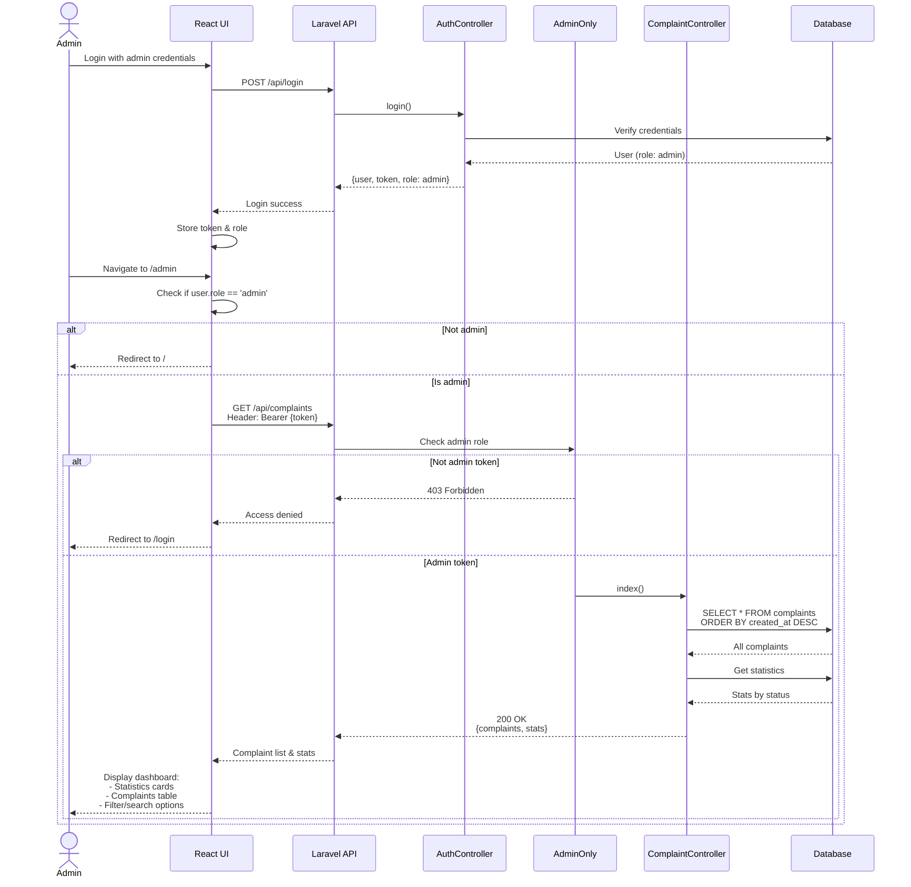
```mermaid
sequenceDiagram
    actor Admin
    participant UI as React UI
    participant API as Laravel API
    participant Auth as AuthController
    participant Middleware as AdminOnly
    participant Controller as ComplaintController
    participant DB as Database
    
    Admin->>UI: Login with admin credentials
    UI->>API: POST /api/login
    API->>Auth: login()
    Auth->>DB: Verify credentials
    DB-->>Auth: User (role: admin)
    Auth-->>API: {user, token, role: admin}
    API-->>UI: Login success
    UI->>UI: Store token & role
    
    Admin->>UI: Navigate to /admin
    UI->>UI: Check if user.role == 'admin'
    
    alt Not admin
        UI-->>Admin: Redirect to /
    else Is admin
        UI->>API: GET /api/complaints<br/>Header: Bearer {token}
        API->>Middleware: Check admin role
        
        alt Not admin token
            Middleware-->>API: 403 Forbidden
            API-->>UI: Access denied
            UI-->>Admin: Redirect to /login
        else Admin token
            Middleware->>Controller: index()
            Controller->>DB: SELECT * FROM complaints<br/>ORDER BY created_at DESC
            DB-->>Controller: All complaints
            Controller->>DB: Get statistics
            DB-->>Controller: Stats by status
            Controller-->>API: 200 OK<br/>{complaints, stats}
            API-->>UI: Complaint list & stats
            UI-->>Admin: Display dashboard:<br/>- Statistics cards<br/>- Complaints table<br/>- Filter/search options
        end
    end
```

### 4.2 Update Complaint Status

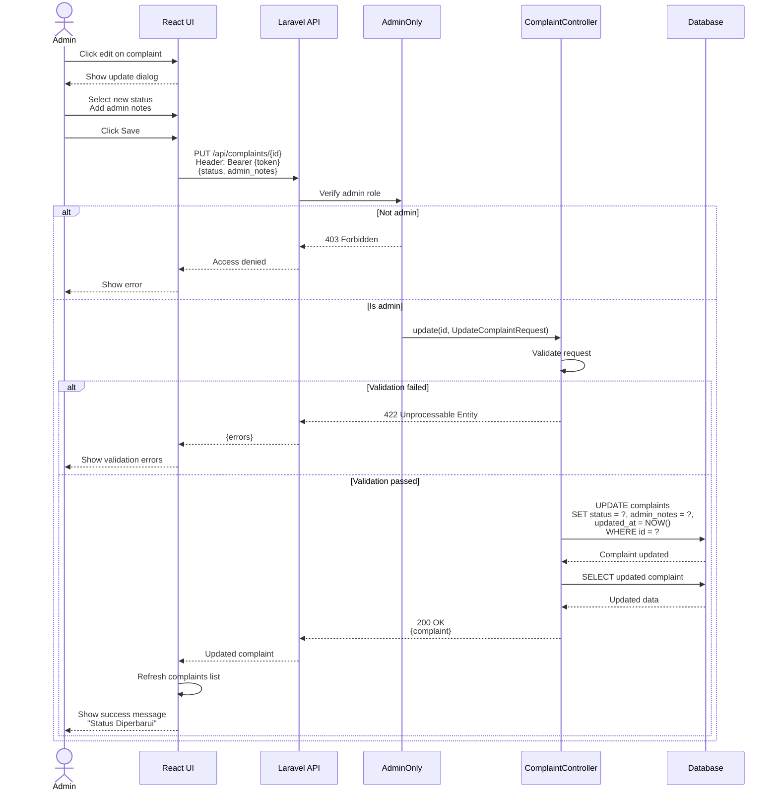
```mermaid
sequenceDiagram
    actor Admin
    participant UI as React UI
    participant API as Laravel API
    participant Middleware as AdminOnly
    participant Controller as ComplaintController
    participant DB as Database
    
    Admin->>UI: Click edit on complaint
    UI-->>Admin: Show update dialog
    Admin->>UI: Select new status<br/>Add admin notes
    Admin->>UI: Click Save
    
    UI->>API: PUT /api/complaints/{id}<br/>Header: Bearer {token}<br/>{status, admin_notes}
    API->>Middleware: Verify admin role
    
    alt Not admin
        Middleware-->>API: 403 Forbidden
        API-->>UI: Access denied
        UI-->>Admin: Show error
    else Is admin
        Middleware->>Controller: update(id, UpdateComplaintRequest)
        Controller->>Controller: Validate request
        
        alt Validation failed
            Controller-->>API: 422 Unprocessable Entity
            API-->>UI: {errors}
            UI-->>Admin: Show validation errors
        else Validation passed
            Controller->>DB: UPDATE complaints<br/>SET status = ?, admin_notes = ?,<br/>updated_at = NOW()<br/>WHERE id = ?
            DB-->>Controller: Complaint updated
            Controller->>DB: SELECT updated complaint
            DB-->>Controller: Updated data
            Controller-->>API: 200 OK<br/>{complaint}
            API-->>UI: Updated complaint
            UI->>UI: Refresh complaints list
            UI-->>Admin: Show success message<br/>"Status Diperbarui"
        end
    end
```

### 4.3 View Complaint Details (Admin)

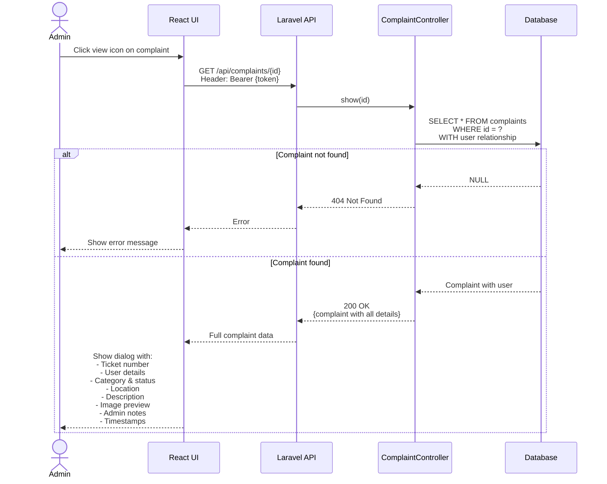
```mermaid
sequenceDiagram
    actor Admin
    participant UI as React UI
    participant API as Laravel API
    participant Controller as ComplaintController
    participant DB as Database
    
    Admin->>UI: Click view icon on complaint
    UI->>API: GET /api/complaints/{id}<br/>Header: Bearer {token}
    API->>Controller: show(id)
    Controller->>DB: SELECT * FROM complaints<br/>WHERE id = ?<br/>WITH user relationship
    
    alt Complaint not found
        DB-->>Controller: NULL
        Controller-->>API: 404 Not Found
        API-->>UI: Error
        UI-->>Admin: Show error message
    else Complaint found
        DB-->>Controller: Complaint with user
        Controller-->>API: 200 OK<br/>{complaint with all details}
        API-->>UI: Full complaint data
        UI-->>Admin: Show dialog with:<br/>- Ticket number<br/>- User details<br/>- Category & status<br/>- Location<br/>- Description<br/>- Image preview<br/>- Admin notes<br/>- Timestamps
    end
```

## 5. Image Upload Process

### 5.1 Image Upload with Complaint

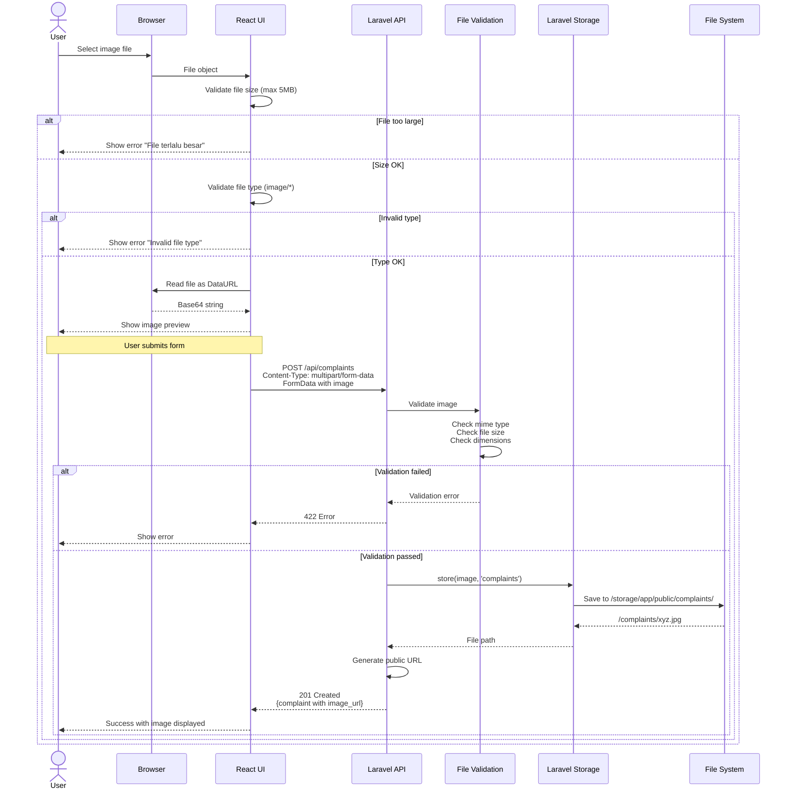
```mermaid
sequenceDiagram
    actor User
    participant Browser as Browser
    participant UI as React UI
    participant API as Laravel API
    participant Validation as File Validation
    participant Storage as Laravel Storage
    participant FileSystem as File System
    
    User->>Browser: Select image file
    Browser->>UI: File object
    UI->>UI: Validate file size (max 5MB)
    
    alt File too large
        UI-->>User: Show error "File terlalu besar"
    else Size OK
        UI->>UI: Validate file type (image/*)
        
        alt Invalid type
            UI-->>User: Show error "Invalid file type"
        else Type OK
            UI->>Browser: Read file as DataURL
            Browser-->>UI: Base64 string
            UI-->>User: Show image preview
            
            Note over User,UI: User submits form
            
            UI->>API: POST /api/complaints<br/>Content-Type: multipart/form-data<br/>FormData with image
            API->>Validation: Validate image
            Validation->>Validation: Check mime type<br/>Check file size<br/>Check dimensions
            
            alt Validation failed
                Validation-->>API: Validation error
                API-->>UI: 422 Error
                UI-->>User: Show error
            else Validation passed
                API->>Storage: store(image, 'complaints')
                Storage->>FileSystem: Save to /storage/app/public/complaints/
                FileSystem-->>Storage: /complaints/xyz.jpg
                Storage-->>API: File path
                API->>API: Generate public URL
                API-->>UI: 201 Created<br/>{complaint with image_url}
                UI-->>User: Success with image displayed
            end
        end
    end
```

## 6. Error Handling Sequences

### 6.1 Network Error Handling

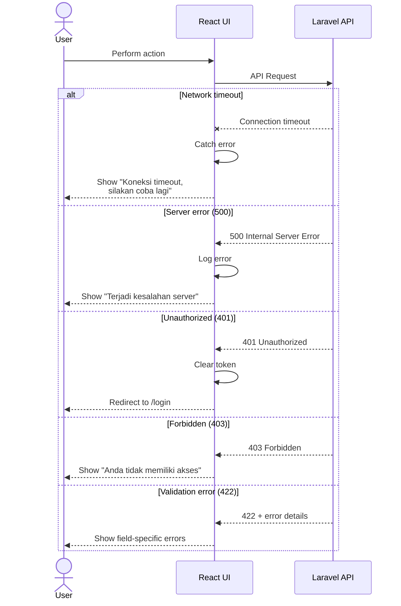
```mermaid
sequenceDiagram
    actor User
    participant UI as React UI
    participant API as Laravel API
    
    User->>UI: Perform action
    UI->>API: API Request
    
    alt Network timeout
        API--xUI: Connection timeout
        UI->>UI: Catch error
        UI-->>User: Show "Koneksi timeout,<br/>silakan coba lagi"
    else Server error (500)
        API-->>UI: 500 Internal Server Error
        UI->>UI: Log error
        UI-->>User: Show "Terjadi kesalahan server"
    else Unauthorized (401)
        API-->>UI: 401 Unauthorized
        UI->>UI: Clear token
        UI-->>User: Redirect to /login
    else Forbidden (403)
        API-->>UI: 403 Forbidden
        UI-->>User: Show "Anda tidak memiliki akses"
    else Validation error (422)
        API-->>UI: 422 + error details
        UI-->>User: Show field-specific errors
    end
```

### 6.2 Token Expiration Handling

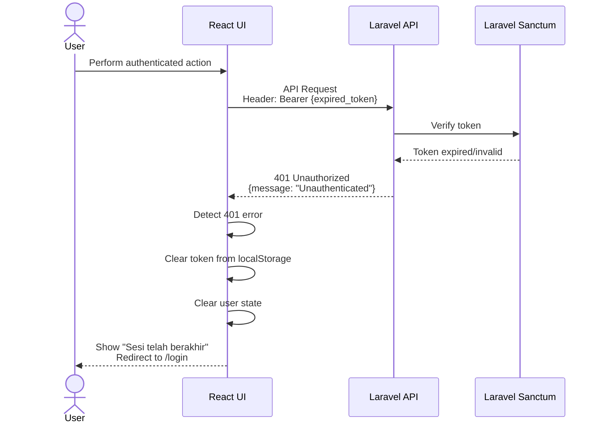
```mermaid
sequenceDiagram
    actor User
    participant UI as React UI
    participant API as Laravel API
    participant Sanctum as Laravel Sanctum
    
    User->>UI: Perform authenticated action
    UI->>API: API Request<br/>Header: Bearer {expired_token}
    API->>Sanctum: Verify token
    Sanctum-->>API: Token expired/invalid
    API-->>UI: 401 Unauthorized<br/>{message: "Unauthenticated"}
    UI->>UI: Detect 401 error
    UI->>UI: Clear token from localStorage
    UI->>UI: Clear user state
    UI-->>User: Show "Sesi telah berakhir"<br/>Redirect to /login
```

## 7. Real-time Status Updates (Future Enhancement)

### 7.1 WebSocket/Pusher Integration (Optional)

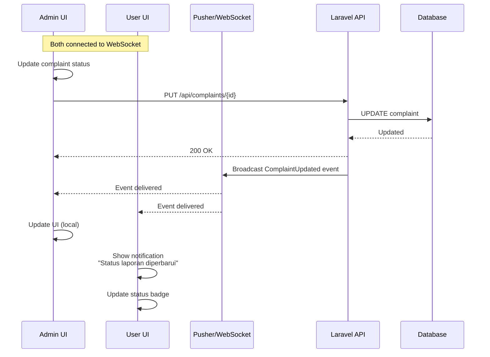
```mermaid
sequenceDiagram
    participant Admin as Admin UI
    participant User as User UI
    participant Pusher as Pusher/WebSocket
    participant API as Laravel API
    participant DB as Database
    
    Note over Admin,User: Both connected to WebSocket
    
    Admin->>Admin: Update complaint status
    Admin->>API: PUT /api/complaints/{id}
    API->>DB: UPDATE complaint
    DB-->>API: Updated
    API-->>Admin: 200 OK
    API->>Pusher: Broadcast ComplaintUpdated event
    Pusher-->>Admin: Event delivered
    Pusher-->>User: Event delivered
    Admin->>Admin: Update UI (local)
    User->>User: Show notification<br/>"Status laporan diperbarui"
    User->>User: Update status badge
```

## Summary

Sequence diagram ini menggambarkan:

1. **Authentication Flow**: Registrasi, login, dan logout dengan token management
2. **Complaint Submission**: Pengajuan laporan dengan validasi dan upload gambar
3. **Tracking System**: Pencarian dan penampilan detail laporan
4. **Admin Operations**: Dashboard access, status updates, dan detail viewing
5. **File Upload**: Proses lengkap upload dan validasi gambar
6. **Error Handling**: Berbagai skenario error dan penanganannya

Setiap sequence menunjukkan interaksi lengkap antara user, UI, API, dan database untuk  memastikan sistem berjalan dengan baik dan aman.
